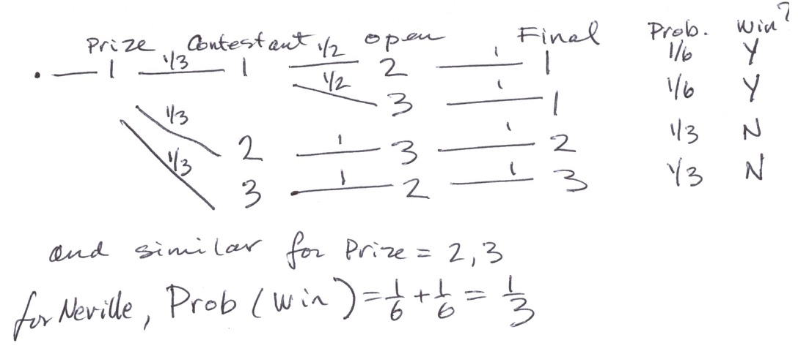
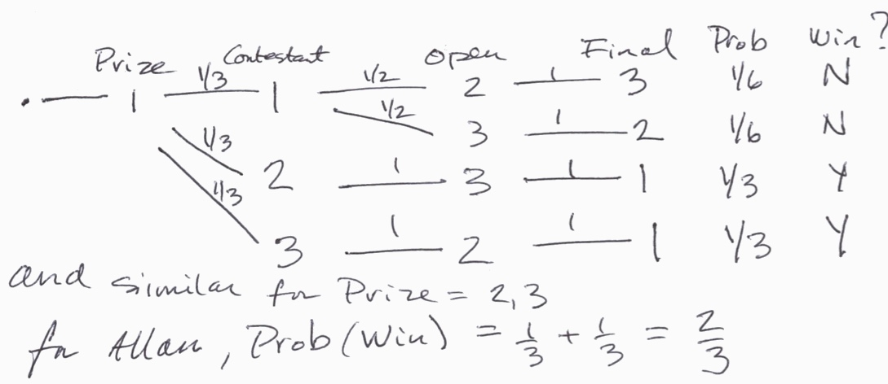

### Course Number: CKME 132
### Section Number: 5J0
### Lecturer: Dr. Arthur Ryman
### Exam Location: VIC 105
### Exam Date: March 4, 2016
### Exam Start Time: 6:45 PM
### Exam Duration: 120 minutes
### Exam Page Count: 17

## Enter your student identification information here:
### Student Last Name:   ______________________
### Student First Name:  ______________________
### Student ID Number:   ______________________

# Exam Rules
- This is an open book exam. You are allowed to use textbooks, notes, and electronic calculators that do not have network access.
- You are NOT allowed to use or have in your possession computers, tablets, or phones. Place all prohibited digital devices at the front of the room.
- If you need to leave the room during the exam, raise your hand and wait for someone to accompany you. You must not speak to anyone while out of the room.
- Leave ample space between yourself and other students. Do not speak to other students during the exam. Do not look at other students' answers during the exam.
- Thank you for following these rules.

# Exam Marking
- The exam contains 10 questions that are worth 10 marks each, for a total of 100 marks
- Each question has one or more parts whose value is indicated like: [2 marks]

\newpage

# 1. Basic Data Concepts

Answer the following questions and give examples:

a) [1 mark] What is an *experiment*? 

An experiment is a procedure for measuring or observing attributes of an individual or system in order to collect data that can be used to answer some question.

For example, voters are polled to predict the outcome of an election.

b) [1 mark] What is an *experimental unit*?

An experimental unit of the potential subject of an experiment which produces a set a values for one or more variables when the experiment is performed.

For example each registered voter is an experimental unit for an election poll.

c) [1 mark] Define the terms *population* and *sample*.

A population is the set of all possible experimental units.

A sample is a subset of experimental units that are measured or observed in an experiment.

For example, in an election poll the population is the set of all registered voters. The sample is the set of registered voters than are polled.

d) [1 mark] Define the terms *parameter* and *statistic*.

A parameter is an attribute of a population.

A statistic is an attribute computed from a sample.

For example, the number of Liberals among all registered voters is a parameter. The frequency of Liberals in a sample is a statistic.

\newpage

e) [1 mark] What is the difference between *qualitative* and *quantitative* data?

Qualitative data does not have a natural magnitude and may not even be ordered.

Quantitative data has a numeric magnitude.

For example, political party is qualitative data. Height is quantitative data.

f) [1 mark] What is the difference between *discrete* and *continuous* data?

Both are quantitative. 

In discrete data there are a countable number of values separated by gaps.

In countinuous data there are infinitely many values between any two.

For example, the number of wheels on a vehicle is discrete while weight of vehicle is continuous.

g) [2 marks] Define the terms *univariate*, *bivariate*, and *multivariate* data.

Univariate data consists of one value, e.g. weight.

Bivariate data consists of two values, e.g. the x and y coordinates of a point in the plane.

Multivariate data consists of more than two values, e.g. the lengthm width, and height of a box.

h) [2 marks] Define the terms *sample space*, *simple event*, and *event*.

Sample space is the set of all possible values of an outcome, e.g. {H,T} for a coin toss.

Simple event is a point or member of the sample space, e.g. H and T are each simple events in {H, T}.

Event is any subset of the sample space, e.g. $\emptyset$, {H}, {T}, {H,T} for a coin toss.

\newpage

# 2. Numeric Measures

A factory produces bags of road salt that are supposed to weight 10 kg each.
Each hour ten bags are selected at random from the output and weighed.
The following `weight` vector contains the weights of the sample for one hour.

```{r, echo=FALSE}
weight <- c(10.2, 10.3, 9.9, 9.7, 10.1, 10.2, 9.8, 9.9, 9.8, 10.2)
```

```{r}
weight
```

Calculate the numeric values of the following statistics. 
You may use an electronic calculator or do the calculation manually.

a) [2 marks] Calculate the mean.

Let weight = $w_1, w_2, \ldots, w_n$

mean(weight) = $\bar{w} = \frac{1}{n}\sum_{i=1}^n w_i$

```{r}
mean(weight)
```

b) [2 marks] Calculate the sample variance.

var(weight) = $\sigma^2 = \frac{1}{n-1}\sum_{i=1}{n}(w_i - \bar{w})^2$

```{r}
var(weight)
```

c) [2 marks] Calculate the sample standard deviation.

sd(weight) = $\sigma = \sqrt{\sigma^2}$

```{r}
sd(weight)
```

\newpage

d) [1 mark] Calculate the median.

```{r}
median(weight)
```

e) [1 mark] Calculate the minimum.

```{r}
(w.min <- min(weight))
```

f) [1 mark] Calculate the maximum.

```{r}
(w.max <- max(weight))
```

g) [1 mark] Calculate the range.

$\mathrm{range} = w_{\mathrm{max}} - w_{\mathrm{mix}}$

```{r}
range(weight)
w.max - w.min
```

\newpage

# 3. Presenting Data Graphically

Answer by stating the kind of graph best suited to the data and goal.

a) [2 marks] The data is budget information. It shows how much is spent on each type of item. You want to show the proportion of each item relative to the total budget.

Pie chart of budget amount per item.

b) [2 marks] The data is colour preferences for new cars. It shows how many new cars were sold for each of the available paint colours. You want to compare the colours to each other.

Bar chart of frequency per colour.

c) [3 marks] The data is growth rates for a new kind of cattle feed. It shows how fast calves gain weight while eating the new feed. The calves are weighed once a week for 6 months. You want to show how the calve's weight changes over the time period.

Line chart of weight versus time.

d) [3 marks] The data is a clinical study on the affect of daily vitamin C consumption on the survival rate after a patient is diagnosed with pancreatic cancer. The data consists of the daily intake of vitamin C in milligrams, and the number of days the patient survives after being diagnosed. You want to visually explore the data to see if there is any correlation.

Scatter plot of survival time versus vitamin C consumption.

\newpage

# 4. Graphing a Data Set

The `cars` data frame contains observations of the stopping distance required from a given speed for 50 cars built during the 1920s.
Consider just the first 10 observations:

```{r}
cars[1:10,]
```

a) [10 marks] Sketch a scatter plot of stopping distance versus speed. 
Draw tick marks and coordinate value labels on the axes.
Include titles for the graph and the axes. 

```{r}
(speed <- cars[1:10,1])
(dist <- cars[1:10,2])
plot(speed,dist,main="Car Stopping Distance versus Speed",xlab="speed",ylab="distance")
```

\newpage

# 5. Basic Probability

You are playing a new board game that has two unusual dice. The first die has four faces labelled 2, 4, 6, 8. The second die has six faces labelled 0, 1, 2, 3, 4, 5. The dice are fair so all the faces on each die have equal probability.

a) [2 marks] Describe the sample space. How many simple events are there? 

The sample space consists of all pairs {2,4,6,8}x{0,1,2,3,4,5}. 

There are 4x6=24 simple events.

b) [4 marks] List all the simple events in a table. Add two columns and compute the product and the sum of the faces for each simple event.

```{r}
d1 <- seq(2,8,by=2)
d2 <- 0:5
game <- data.frame(f1=rep(d1,each=6),f2=rep(d2,times=4))
game$product <- game$f1 * game$f2
game$sum <- game$f1 + game$f2
game
```

c) [2 marks] What is the probability that the product of the two dice is even?

P(even) = 1 since all products are even.


d) [2 marks] What is the probability that the sum the two dice is greater than 10?

```{r}
sum(game$sum > 10)/24
```

\newpage

# 6. Probability Application

In the game show *Let's Make a Deal* there are three closed doors and there is a valuable prize behind just one of them. The host, Monty Hall, knows where the prize is. The contestant picks one of the doors and leaves it closed. Monty Hall then picks one of the other doors and opens it revealing that the prize is not there. Monty Hall then asks the contestant if they would like to keep their original choice of door or switch to the other closed door.

We can regard each game played by a contestant as an experiment.
Each game is a four-stage process.
First, Monty Hall randomly selects a door and hides the prize behind it. Assume each door has equal probability.
Second, the contestant randomly selects a door. Assume each door has equal probability.
Third, Monty Hall selects one of the remaining doors that does not hide the prize and opens it. 
If the contestant picked the correct door, then Monty has two choices. Assume they have equal probability. If the contest did not select the correct door, then Monty has only one choice.
Fourth, the contestant decides to keep their selection or switch. The probability depends on the contestant's strategy.

Since random choices are involved, we can regard each game as simple event in a sample space and can assign it a probability. We can then calculate the probability of winning for various contestant's strategies.

a) [4 marks] Neville is a contestant and his strategy is to never switch doors. Draw the tree diagram for Neville. What is the probability that Neville would win the prize?

Let D be the set of doors. D = {1,2,3}. 
A simple event in the sample space of all games is determined by an ordered
4-tuple of doors which we denote (Prize,Contestant,Open,Final) where
Prize is the door that hides the prize, Contestant is the door that the contestant selects, Open is the door that Monty Hall opens, and Final is the
final door selected by the Contestant. Not all possible 4-tuples of doors are allowed by the rules of the game.

Open != Prize and Open!= Contestant because Monty Hall will never open the door that hides the prize or the door selected by the contestant.

Final != Open because the contestant can never select the open door.

The following tree diagram shows the games played by Neville, starting with the prize being hidden behind door 1. The diagrams for doors 2 and 3 are similar.
The numbers on the lines of the diagram are the conditional probabilities for each possible choice for the next stage given a value of the current stage.
The total probability of the simple is the product of all the conditional probabilities that connect to root of the tree to the final stage.

For example, the simple event (1,1,2,1) is read as the prize is behind door 1, the contestant selects door 1, Monty Hall opens door 2, and the contestants stays with door 1 as his final selection. This event is a win for the contestant and his a conditional probability of 1/6 given that the prize is behind door 1.



Neville's probability of winning is 1/3 because there is 1 prize and 3 doors.

\newpage

b) [4 marks] Allan is another contestant and his strategy is to always switch doors. Draw the tree diagram for Allan. What is the probability that Allan would win the prize?



Allan's probability of winning is 2/3 because it is the complement of Neville's.

c) [2 marks] Do these strategies have different probabilities of winning? If so, which strategy is better?

The strategies are different. Allan's strategy is twice as good as Neville's.

\newpage

# 7. Permutations and Combinations

A wall safe in a hotel has a keypad with the 10 digits 0, 1, 2, ..., 9. You set the combination by keying in a sequence of four digits.

a) [2 marks] Suppose that repeated digits are allowed. What is the probability that someone could open the safe by trying one randomly chosen combination?

There are 10 possible values for each of the four values. The total number of
possible safe combinations N is therefore:

```{r}
(N <- 10^4)
```

All safe combinations are equally probable to the probability of guessing it correctly in one attempt is 1/N.

```{r}
1/N
```

b) [2 marks] Suppose the wall safe did not allow you to repeat a digit. What would the probability be then?

The order is still significant, but now there are fewer choices. N is the
number of permutations of four numbers chosen without replacement from a set of 10.

```{r}
(N <- 10 * 9 * 8 * 7)
(Prob <- 1/N)
```

c) [3 marks] Suppose there are $N$ possible wall safe combinations. What is the probability that someone can guess the correct combination on their first attempt? What is the probability that they don't guess it?

$$
\mathrm{Prob(Correct)} = \frac{1}{N}
$$

$$
\mathrm{Prob(Incorrent)} = 1 - \mathrm{Prob(Correct)} = 1 - \frac{1}{N} = \frac{N-1}{N}
$$

d) [3 marks] Suppose someone picks $M$ different wall safe combinations from the set of $N$ possible combinations. What is the probability that all $M$ combinations are wrong?

Solution 1: The Short Way

The probability that any one of the $N$ wall safe combinations is correct is $\frac{1}{N}$.
This is a uniform distribution on the sample space of all possible combinations.
Therefore, the probability that a randomly chosen subset of $M$ combinations contains the correct combination is $\frac{M}{N}$. 
$$
\mathrm{Prob(one\ of\ the\ M\ is\ correct)} = \frac{M}{N}
$$

The probability that all M combinations are wrong is the complement:
$$
\mathrm{Prob(all\ M\ are\ incorrect)} = 1 - \frac{M}{N} = \frac{N-M}{N}
$$

Solution 2: The Long Way

Let n and k be non-negative integers with k <= n.
The number of combinations of k elements chosen from a set of n elements is given by the binomial coefficient:
$$C_k^n = \frac{n!}{k!(n-k)!}$$

The number of sets of M wall safe combinations taken from the set of all N possible wall safe combinations is therefore $C_M^N$.

There is one correct combination and N-1 incorrect combinations. The number of sets of M incorrect combinations is therefore $C_M^{N-1}$.

The probability that you pick a set of M incorrect combinations is therefore:
$$
\mathrm{Prob(all\ M\ are\ incorrect)} = \frac{C_M^{N-1}}{C_M^N} = \frac{N-M}{N}
$$
\newpage

# 8. R Expressions

In the following questions, write down the expected output of the give R code.

a) [1 mark] 
```{r}
1+1
```

b) [1 mark] 
```{r}
2-3*4
```

c) [1 mark] 
```{r}
x <- 5
y <- 6
x*y
```

d) [1 mark] 
```{r}
4:10
```

e) [1 mark] 
```{r}
seq(3,9,by=3)
```

\newpage

f) [1 mark] 
```{r}
c("Ryerson", "University")
```

g) [1 mark] 
```{r}
xx <- 1:10
yy <- 10:1
c(xx,yy)
```

h) [1 mark] 
```{r}
xx < yy
```

i) [1 mark] 
```{r}
xx[xx < yy]
```

j) [1 mark] 
```{r}
matrix(12:1, nrow=4)
```

\newpage

# 9. R Functions

Answer by giving the name of the R function that performs the described task.

a) [1 mark] Draw a scatterplot.

plot

b) [1 mark] Draw a histogram.

hist

c) [1 mark] Compute the total of a data vector.

sum

d) [1 mark] Compute the average of a data vector.

mean

e) [1 mark] Compute the standard deviation of a data vector.

sd

\newpage

f) [1 mark] Compute the min, max, mean, median, Q1, and Q3 of a data vector.

summary

g) [1 mark] Create a matrix from a data vector.

matrix

h) [1 mark] Create a data frame from a set of data vectors.

data.frame

i) [1 mark] Create a list from a set of data vectors.

list

j) [1 mark] Generate a random sample from a normal distribution.

rnorm

\newpage

# 10. R Programming

Write down the output of the following R programs.

a) [2 marks] 
```{r}
for(x in 5:8) print(x^2)
```

b) [2 marks] 
```{r}
x <- 4
y <- 6
if(x > y) print("red") else print("black")
```

\newpage

c) [3 marks] 
```{r}
ff <- function(x,y) x+2*y
for (z in 1:3) print(ff(z,1-z))
```

d) [3 marks] 
```{r}
i <- 0
repeat{ print(i); i <- i + 1; if (i > 3) break}
```

# END OF EXAM